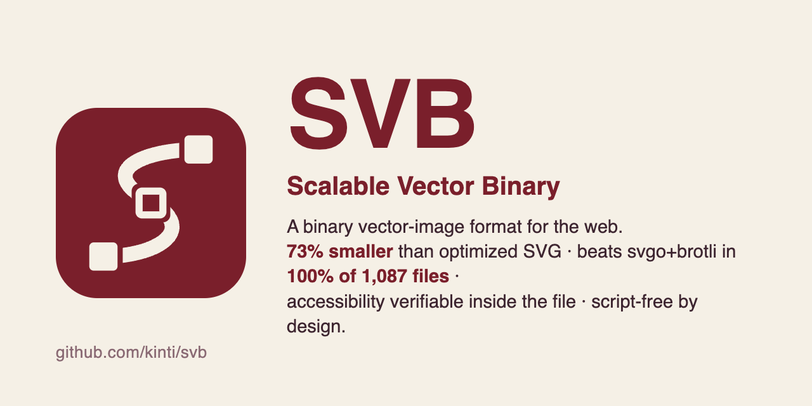

# SVB — Scalable Vector Binary

<p align="center"></p>

**A binary vector-image format for the web** · v0.1 · specification + reference implementation.

[](https://github.com/kinti/svb/actions/workflows/tests.yml)
[](https://github.com/kinti/svb/security/code-scanning)
[](https://github.com/kinti/svb/releases)
[](LICENSE)


[](https://kinti.github.io/svb/demo/)

**▶ Live demo: <https://kinti.github.io/svb/demo/>** — `` working in today's browsers via a Service Worker. No plugin, no new browser engine.

> También disponible en [español](README.es.md) · Artículo del proyecto: <https://jquin.net/svb/>

## Why this exists

SVG is stuck — and that is exactly why there is room to improve it:

1. **The standard is frozen.** SVG 2 died as an abandoned Candidate Recommendation and the W3C Working Group is dormant. SVG's structural problems will never be fixed from the inside; improvement can only come from outside — the same way JPEG XL happened for raster images.
2. **SVG is text, and text is expensive.** Every coordinate costs 3–8 bytes of ASCII, the same boilerplate repeats in every single file, and generic transport compression (gzip/brotli) cannot see the structure it is compressing.
3. **Accessibility is optional in practice.** `<title>`, `<desc>`, ARIA inside SVG: almost nobody ships them, and nothing in the format itself can verify them.

SVB turns each problem into a concrete improvement path:

- **Binary encoding** — delta zigzag coordinates, fixed-point quantization, interned style table. On the samples in this repo, the raw binary is already *smaller than brotli-compressed SVG*.
- **Accessibility as a first-class chunk** — a fixed-grammar A11Y chunk announced by a header flag. Validators can require it; auditors can certify it. In SVG these are optional attributes nobody ships; here the format itself can demand them.
- **A chunk container built for evolution** — decoders skip chunks they don't know, so progressive rendering (v0.2) and declarative animation without SMIL (v0.2, reserved) can be added without breaking anything.

Precedents, honestly stated: TinyVG proved a binary SVG subset can hit ~39% of the size — but it targets embedded systems, with no web runtime, no animation, no accessibility. Lottie and Rive prove that "format + own runtime" wins adoption *without* waiting for browser vendors — the Service Worker polyfill in this repo is exactly that path. And JPEG XL is the reminder that being technically superior is not enough; adoption is political. SVB is designed so that even the "it never takes off" scenario leaves value behind: a rigorous spec, a working codec, and a live demo.

## The logo, in its own format

The mark — an S-shaped vector path whose anchor points are binary bits (filled = 1, hollow = 0) — is drawn entirely within SVB v0.1's own subset (solid fills, no text, no gradients), so the format can carry its own branding: **the logo as SVG weighs 789 B; as `.svb` it weighs 150 B (19%)**. Palette `#7A1F2B` / `#F5F0E6` passes WCAG AAA (contrast 8.98:1, verified with the author's own [a11y-toolkit](https://github.com/kinti/a11y-toolkit)). Files in [`brand/`](brand/).

## Numbers — real-world corpus

**1,087 production SVGs** (Feather 287, Bootstrap Icons 400, Simple Icons 400 — seed 42), each optimized with **svgo multipass** first. Full data: **[live benchmark page](https://kinti.github.io/svb/benchmark/)** · `benchmark/run.mjs` reproduces it.

| metric | result |
|---|---|
| Median svb / svg-optimized | **×0.272** (mean ×0.270) |
| SVB raw smaller than svgo+brotli | **100% of files** |
| Median svb+brotli / svgo+brotli | ×0.541 |
| Median size | 467 B svg → **139 B svb** |
| Clean encodes | 1,087 / 1,087 (0 lossy, 0 excluded, round-trip verified) |

By source: Feather ×0.205 · Bootstrap ×0.279 · Simple Icons ×0.305. The worst file in the corpus still saves ~47%.

## Numbers — handmade samples (the repo's `demo/samples/`)

| file | svg | +gzip | +brotli | **svb** | svb+gzip | svb+brotli | svb/svg |
|---|---|---|---|---|---|---|---|
| icon-pin.svg | 328 | 240 | 199 | **86** | 109 | 90 | **26%** |
| illustration.svg | 946 | 513 | 462 | **303** | 326 | 307 | **32%** |
| logo-star.svg | 380 | 275 | 230 | **123** | 146 | 127 | **32%** |

The headline: **raw SVB is smaller than brotli-compressed SVG** — the win comes from the format itself, not from transport compression. (Note: SVB is already so dense that gzip/brotli on top *grows* it — compressing the compressed. Servers should not re-compress `.svb`.)

## Usage

```bash
node src/cli.js encode in.svg out.svb
node src/cli.js decode out.svb back.svg
node src/cli.js roundtrip in.svg      # encode→decode, writes the decoded SVG
node src/cli.js bench in.svg [more…]  # svg/gzip/brotli/svb size table
npm test                              # 19 tests (node:test, zero dependencies)
```

## Demo (Service Worker polyfill)

Live at <https://kinti.github.io/svb/demo/>. Locally: `python3 -m http.server 8923` from the repo root, then open `/demo/`.

A Service Worker intercepts `*.svb` requests, decodes them (DecompressionStream + the decoder in this repo) and responds `image/svg+xml`, so `` just works in any current browser. **The polyfill is the format's entry path** — the same "format + runtime" move that worked for Lottie and Rive.

## Repository layout

```
SPEC.md              byte-level specification (v0.1)
SPEC.es.md           Spanish version of the spec
src/svb.js           primitives: varuint / zigzag varint, fixed-point, colors
src/xml.js           minimal XML parser (SVG subset)
src/path.js          path-data parser/normalizer (→ canonical M,L,C,Q,A,Z)
src/encoder.js       SVG → SVB (bakes viewBox/transforms, interns styles)
src/decoder.js       SVB → SVG (skips unknown chunks: forward compatible)
src/browser-decode.js  async decode via DecompressionStream
src/cli.js           encode/decode/roundtrip/bench
demo/                Service Worker + comparison page
benchmark/           real-world corpus benchmark (run.mjs, results, live page)
test/                round-trips, varint fuzz, forward-compat, error handling
```

## v0.1 limitations (documented, not hidden)

- Subset: `g`, `path`, `rect`, `circle`, `ellipse`, `line`, `polyline`, `polygon` with solid fill, stroke, opacity, dash arrays and transforms. **Not yet**: gradients, filters, `<text>`, `<use>/<defs>`, `<image>`, embedded CSS, clip/mask (the encoder warns and skips/replaces them).
- Presentation attributes only (no CSS inheritance from `<style>`).
- Arc rotations quantized to whole degrees; coordinates to `1/coord_scale` (default 1/64 ≈ 0.016).

## Roadmap

1. ~~**Real-world corpus**~~ *(done — see [benchmark](https://kinti.github.io/svb/benchmark/): 1,087 files, median ×0.272)*. Widen it: illustration-heavy sources with gradients to drive v0.2 priorities.
2. **Rust → WASM**: port the hot path; one binary for CLI and web.
3. **ANIM chunk (v0.2)**: declarative keyframes without SMIL.
4. **Real progressive rendering**: chunk ordering from base layer to refinement.
5. **Validator + "accessible SVB" seal**: audit-ready (connects with accessibility auditing under EU Web Accessibility Directive / Spain's Ley 11/2023).
6. **Fuzzing + security review**: required before any production use with untrusted files.

## Publication path

1. This repo: versioned spec + reference implementation + test suite *(done)*.
2. Register the `image/svb` media type with **IANA** (expert review, RFC 6838) — free and formal.
3. With traction: a **W3C Community Group** publishing a CG Report (creating one is free and open to individuals).
4. Honest precedents: TinyVG, Lottie and Rive were never consortium standards and still matter. Adoption decides; the consortium, if it ever comes, comes after.

## Security notes

By design, SVB **cannot carry scripts** — there is no script chunk and the reference decoder only emits geometry and accessibility text, which removes SVG's classic XSS vector (user-uploaded SVG logos).

**v0.1.1 hardening** (audited 2026-08-30, with proof-of-concept tests kept in `test/security.test.js`): a ~20-byte hostile file that declared 134 million path commands exhausted 4 GB of heap (now rejected in microseconds by counter bounds + EOF guards); a 199 KB compressed bomb expanded unbounded to 200 MB of RAM (now capped at 64 MB, aborting mid-stream); adversarial SVG attribute lists no longer trigger quadratic parsing. The rules are normative in [SPEC §12](SPEC.md).

Still recommended before production use with untrusted files: formal fuzzing beyond the regression suite (radamsa or similar).

## License

MIT — © 2026 Jesús Quintana · [jquin.net](https://jquin.net/)
